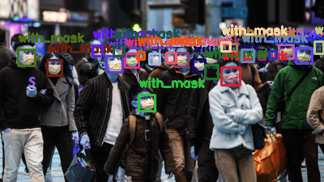

# Face Mask Detection

> detects people whether they are wearing masks correctly, incorrectly, or not wearing a mask



## Getting Started

### Prerequisites
1. **Python Environment**: Python 3.12 or higher
2. **Virtual Environment** (optional but recommended)
3. **Install Requirements**:
   ```bash
   pip install notebook

   # with CUDA, if possible: https://pytorch.org/get-started/locally/
   pip install torch torchvision torchaudio --index-url https://download.pytorch.org/whl/cu124  
   ```
   Libraries:
   - `notebook`
   - [`torch`](https://pytorch.org/get-started/locally/) (CUDA, if available)

### Running the Notebook
1. **Starts the Jupyter**:
   Start Jupyter Notebook:
   ```bash
   jupyter notebook
   ```

2. **Run the notebook**:
   Open and run the notebook `face-mask-detection.ipynb`.
